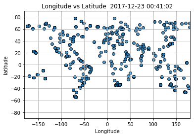
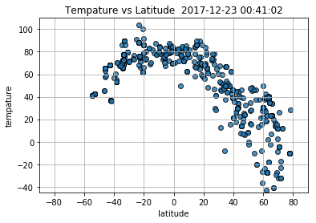
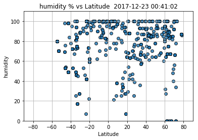
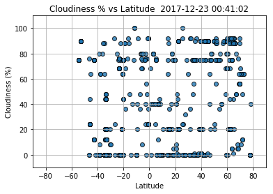
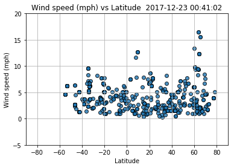

Here I would like to visualize the weather of 500+ cities across the world of varying distance from the equator. To accomplish this, I created the random generator for Latitude and Longitude and used the citipy library to get the name of the cities. Then I requested to get the weather information of these cities from openweather.com to create a representative model of the weather across world.
Below are my three observable trends based on the data.
1.	Based on the plot I have on Latitude and Longitude, I can observe I have a great distribution of the cities around the globe. The time of collecting data during the day did not effect on what I observe on my plots because this collection is from around the globe and in different time zone. 
2.	You can see how weather is changing based on the latitude, around the latitude of zero the weather is warmer. Also, since it is the winter time on the north hemisphere, when you go toward the north (latitude > 0) the weather gets colder, and cloudier.

3.	 The humidity is higher closer to the equator. And the speed of the wind is not higher than 10 at most of places around the globe. 


```python
## WeatherPy


```


```python
# Dependencies
from citipy import citipy
import csv
import json
import gzip
import matplotlib.pyplot as plt
import requests as req
import pandas as pd
import random
import math
from datetime import datetime

cities = []
filename = 'apikey.txt'

def get_file_contents(filename):
    """ Given a filename,
        return the contents of that file
    """
    try:
        with open(filename, 'r') as f:
            # It's assumed our file contains a single line,
            # with our API key
            return f.read().strip()
    except FileNotFoundError:
        print("'%s' file not found" % filename)


def ts2string(ts, fmt="%Y-%m-%d %H:%M:%S"):
    dt = datetime.fromtimestamp(ts)
    return dt.strftime(fmt)


def get_city_list(citycount):
    for i in range(citycount):
        rand_lon = random.randrange(-180, 180, 1)
        rand_lat = random.randrange(-90, 90, 1)
        latitude = round(math.acos(random.random() * 2 - 1) + rand_lat, 2)
        longitude = round(random.random() * math.pi * 2 +rand_lon, 2)
        city = citipy.nearest_city(latitude, longitude)
        cities.append(city.city_name)
        i +=1
        
    return cities

```


```python
# Save config information.
# Create blank columns for necessary fields
valid_lat = []
valid_lon = []   
url = "http://api.openweathermap.org/data/2.5/weather?"
units = "metric"

api_key = get_file_contents(filename)

# Build partial query URL
query_url = url + "appid=" + api_key + "&units=" + units + "&q="


```


```python
weather_data = []
city_count = 0
valid_city = 0
errordatacount = 1
cities = get_city_list(700)

# Loop through the list of cities and perform a request for data on each
for city in cities:
    if valid_city != 550:
                   
        response = req.get(query_url + city).json()
          
        try: 
            valid_lat = response["coord"]["lat"]
            valid_lng = response["coord"]["lon"]
            weather_data.append(response)
            valid_city +=1
            city_count += 1
            #print(city_count, " ", city, ":", query_url + city, "\n")
            
        except:
            print("%s Error with city data. Skipping", errordatacount)
            errordatacount +=1
            
    else:
        exit
            
print(weather_data[0])
```

    %s Error with city data. Skipping 1
    %s Error with city data. Skipping 2
    %s Error with city data. Skipping 3
    %s Error with city data. Skipping 4
    %s Error with city data. Skipping 5
    %s Error with city data. Skipping 6
    %s Error with city data. Skipping 7
    %s Error with city data. Skipping 8
    %s Error with city data. Skipping 9
    %s Error with city data. Skipping 10
    %s Error with city data. Skipping 11
    %s Error with city data. Skipping 12
    %s Error with city data. Skipping 13
    %s Error with city data. Skipping 14
    %s Error with city data. Skipping 15
    %s Error with city data. Skipping 16
    %s Error with city data. Skipping 17
    %s Error with city data. Skipping 18
    %s Error with city data. Skipping 19
    %s Error with city data. Skipping 20
    %s Error with city data. Skipping 21
    %s Error with city data. Skipping 22
    %s Error with city data. Skipping 23
    %s Error with city data. Skipping 24
    %s Error with city data. Skipping 25
    %s Error with city data. Skipping 26
    %s Error with city data. Skipping 27
    %s Error with city data. Skipping 28
    %s Error with city data. Skipping 29
    %s Error with city data. Skipping 30
    %s Error with city data. Skipping 31
    %s Error with city data. Skipping 32
    %s Error with city data. Skipping 33
    %s Error with city data. Skipping 34
    %s Error with city data. Skipping 35
    %s Error with city data. Skipping 36
    %s Error with city data. Skipping 37
    %s Error with city data. Skipping 38
    %s Error with city data. Skipping 39
    %s Error with city data. Skipping 40
    %s Error with city data. Skipping 41
    %s Error with city data. Skipping 42
    %s Error with city data. Skipping 43
    %s Error with city data. Skipping 44
    %s Error with city data. Skipping 45
    %s Error with city data. Skipping 46
    %s Error with city data. Skipping 47
    %s Error with city data. Skipping 48
    %s Error with city data. Skipping 49
    %s Error with city data. Skipping 50
    %s Error with city data. Skipping 51
    %s Error with city data. Skipping 52
    %s Error with city data. Skipping 53
    %s Error with city data. Skipping 54
    %s Error with city data. Skipping 55
    %s Error with city data. Skipping 56
    %s Error with city data. Skipping 57
    %s Error with city data. Skipping 58
    %s Error with city data. Skipping 59
    {'coord': {'lon': 23.37, 'lat': -34.05}, 'weather': [{'id': 801, 'main': 'Clouds', 'description': 'few clouds', 'icon': '02d'}], 'base': 'stations', 'main': {'temp': 18.62, 'pressure': 1020.2, 'humidity': 94, 'temp_min': 18.62, 'temp_max': 18.62, 'sea_level': 1026.91, 'grnd_level': 1020.2}, 'wind': {'speed': 5.3, 'deg': 255.002}, 'clouds': {'all': 12}, 'dt': 1514018462, 'sys': {'message': 0.0045, 'country': 'ZA', 'sunrise': 1513998780, 'sunset': 1514050718}, 'id': 964712, 'name': 'Plettenberg Bay', 'cod': 200}
    


```python
# create the data frame of all the requirment data for the plots

cityname_data = [data.get("name") for data in weather_data]
country_data = [data.get("sys").get("country") for data in weather_data]
lat_data = [data.get("coord").get("lat") for data in weather_data]
lon_data = [data.get("coord").get("lon") for data in weather_data]
temp_data = [(data.get("main").get("temp") * 1.8) + 32 for data in weather_data]
humidity_data = [data.get("main").get("humidity") for data in weather_data]
cloud_data = [data.get("clouds").get("all") for data in weather_data]
wind_data = [data.get("wind").get("speed") for data in weather_data]
time_data = weather_data[0]["dt"]

citiesweather_data = {"Country": country_data, "City Name": cityname_data, "Lon": lon_data,
                      "Lat": lat_data, "Tempature (F)": temp_data, "Humidity": humidity_data,
                      "Cloudiness (%)": cloud_data, "Wind (mph)": wind_data}

citiesweather_data = pd.DataFrame(citiesweather_data)

#write all the info in the csv file
citiesweather_data.to_csv('citiesweatherfile.csv', index=True, header=True)

#convert the date and use it to show on plot
converted_date = ts2string(time_data)

        
citiesweather_data.head(20)

```


<div>
<style>
    .dataframe thead tr:only-child th {
        text-align: right;
    }

    .dataframe thead th {
        text-align: left;
    }

    .dataframe tbody tr th {
        vertical-align: top;
    }
</style>
<table border="1" class="dataframe">
  <thead>
    <tr style="text-align: right;">
      <th></th>
      <th>City Name</th>
      <th>Cloudiness (%)</th>
      <th>Country</th>
      <th>Humidity</th>
      <th>Lat</th>
      <th>Lon</th>
      <th>Tempature (F)</th>
      <th>Wind (mph)</th>
    </tr>
  </thead>
  <tbody>
    <tr>
      <th>0</th>
      <td>Plettenberg Bay</td>
      <td>12</td>
      <td>ZA</td>
      <td>94</td>
      <td>-34.05</td>
      <td>23.37</td>
      <td>65.516</td>
      <td>5.30</td>
    </tr>
    <tr>
      <th>1</th>
      <td>Kavieng</td>
      <td>56</td>
      <td>PG</td>
      <td>100</td>
      <td>-2.57</td>
      <td>150.80</td>
      <td>84.866</td>
      <td>4.05</td>
    </tr>
    <tr>
      <th>2</th>
      <td>High Level</td>
      <td>90</td>
      <td>CA</td>
      <td>85</td>
      <td>58.52</td>
      <td>-117.13</td>
      <td>21.200</td>
      <td>1.00</td>
    </tr>
    <tr>
      <th>3</th>
      <td>Port Moresby</td>
      <td>20</td>
      <td>PG</td>
      <td>95</td>
      <td>-9.47</td>
      <td>147.16</td>
      <td>84.560</td>
      <td>5.52</td>
    </tr>
    <tr>
      <th>4</th>
      <td>Natal</td>
      <td>75</td>
      <td>BR</td>
      <td>88</td>
      <td>-5.81</td>
      <td>-35.21</td>
      <td>78.800</td>
      <td>4.60</td>
    </tr>
    <tr>
      <th>5</th>
      <td>Hilo</td>
      <td>75</td>
      <td>US</td>
      <td>64</td>
      <td>19.71</td>
      <td>-155.08</td>
      <td>58.424</td>
      <td>6.70</td>
    </tr>
    <tr>
      <th>6</th>
      <td>Dhuburi</td>
      <td>24</td>
      <td>IN</td>
      <td>70</td>
      <td>26.03</td>
      <td>89.97</td>
      <td>72.770</td>
      <td>1.82</td>
    </tr>
    <tr>
      <th>7</th>
      <td>Cockburn Town</td>
      <td>48</td>
      <td>TC</td>
      <td>100</td>
      <td>21.46</td>
      <td>-71.14</td>
      <td>77.630</td>
      <td>7.15</td>
    </tr>
    <tr>
      <th>8</th>
      <td>Carnarvon</td>
      <td>0</td>
      <td>ZA</td>
      <td>27</td>
      <td>-30.97</td>
      <td>22.13</td>
      <td>79.286</td>
      <td>2.02</td>
    </tr>
    <tr>
      <th>9</th>
      <td>Lebu</td>
      <td>0</td>
      <td>ET</td>
      <td>38</td>
      <td>8.96</td>
      <td>38.73</td>
      <td>62.636</td>
      <td>1.85</td>
    </tr>
    <tr>
      <th>10</th>
      <td>Avarua</td>
      <td>20</td>
      <td>CK</td>
      <td>73</td>
      <td>-21.21</td>
      <td>-159.78</td>
      <td>75.200</td>
      <td>6.70</td>
    </tr>
    <tr>
      <th>11</th>
      <td>Tuatapere</td>
      <td>44</td>
      <td>NZ</td>
      <td>76</td>
      <td>-46.13</td>
      <td>167.69</td>
      <td>63.266</td>
      <td>4.50</td>
    </tr>
    <tr>
      <th>12</th>
      <td>Faya</td>
      <td>0</td>
      <td>SA</td>
      <td>7</td>
      <td>18.39</td>
      <td>42.45</td>
      <td>68.000</td>
      <td>2.60</td>
    </tr>
    <tr>
      <th>13</th>
      <td>Qaanaaq</td>
      <td>0</td>
      <td>GL</td>
      <td>87</td>
      <td>77.48</td>
      <td>-69.36</td>
      <td>-10.534</td>
      <td>4.00</td>
    </tr>
    <tr>
      <th>14</th>
      <td>Mataura</td>
      <td>24</td>
      <td>NZ</td>
      <td>53</td>
      <td>-46.19</td>
      <td>168.86</td>
      <td>65.030</td>
      <td>2.72</td>
    </tr>
    <tr>
      <th>15</th>
      <td>Katsuura</td>
      <td>0</td>
      <td>JP</td>
      <td>66</td>
      <td>33.93</td>
      <td>134.50</td>
      <td>48.200</td>
      <td>1.50</td>
    </tr>
    <tr>
      <th>16</th>
      <td>Yellowknife</td>
      <td>20</td>
      <td>CA</td>
      <td>67</td>
      <td>62.45</td>
      <td>-114.38</td>
      <td>-27.400</td>
      <td>2.10</td>
    </tr>
    <tr>
      <th>17</th>
      <td>Saint-Philippe</td>
      <td>90</td>
      <td>CA</td>
      <td>85</td>
      <td>45.36</td>
      <td>-73.48</td>
      <td>14.018</td>
      <td>5.10</td>
    </tr>
    <tr>
      <th>18</th>
      <td>Ingham</td>
      <td>36</td>
      <td>AU</td>
      <td>91</td>
      <td>-18.65</td>
      <td>146.16</td>
      <td>80.006</td>
      <td>3.10</td>
    </tr>
    <tr>
      <th>19</th>
      <td>Mahebourg</td>
      <td>75</td>
      <td>MU</td>
      <td>62</td>
      <td>-20.41</td>
      <td>57.70</td>
      <td>86.000</td>
      <td>5.10</td>
    </tr>
  </tbody>
</table>
</div>


```python
# Longitude vs. Latitude

# Build a scatter plot for each data type
plt.scatter(citiesweather_data["Lon"], 
            citiesweather_data["Lat"],
            edgecolor="black", linewidths=1, marker="o", 
            alpha=0.8, label="Zip Codes")

# Incorporate the other graph properties
plt.title("Longitude vs Latitude  " + converted_date)
plt.ylabel("latitude")
plt.xlabel("Longitude")
plt.grid(True)
plt.xlim([-180, 180])
plt.ylim([-90, 90])

# Save the figure
plt.savefig("output_lon_lat.png")

# Show plot
plt.show()
```





```python
# Temperature (F) vs. Latitude

# Build a scatter plot for each data type
plt.scatter(citiesweather_data["Lat"],
            citiesweather_data["Tempature (F)"], 
            edgecolor="black", linewidths=1, marker="o", 
            alpha=0.8, label="Zip Codes")

# Incorporate the other graph properties
plt.title("Tempature vs Latitude  "+ converted_date)
plt.xlabel("latitude")
plt.ylabel("tempature")
plt.grid(True)
plt.xlim([-90, 90])
plt.ylim([-45, 110])

# Save the figure
plt.savefig("output_temp_lat.png")

# Show plot
plt.show()

```





```python
# Humidity (%) vs. Latitude

# Build a scatter plot for each data type
plt.scatter(citiesweather_data["Lat"],
            citiesweather_data["Humidity"], 
            edgecolor="black", linewidths=1, marker="o", 
            alpha=0.8, label="Zip Codes")

# Incorporate the other graph properties
plt.title("humidity % vs Latitude  "+ converted_date)
plt.ylabel("humidity")
plt.xlabel("Latitude")
plt.grid(True)
plt.xlim([-90, 90])
plt.ylim([0, 110])

# Save the figure
plt.savefig("output_humidity_lat.png")

# Show plot
plt.show()

```





```python
# Cloudiness (%) vs. Latitude

# Build a scatter plot for each data type
plt.scatter(citiesweather_data["Lat"],
            citiesweather_data["Cloudiness (%)"], 
            edgecolor="black", linewidths=1, marker="o", 
            alpha=0.8, label="Zip Codes")

# Incorporate the other graph properties
plt.title("Cloudiness % vs Latitude  " + converted_date)
plt.ylabel("Cloudiness (%)")
plt.xlabel("Latitude")
plt.grid(True)
plt.xlim([-90, 90])
plt.ylim([-10, 110])

# Save the figure
plt.savefig("output_cloud_lat.png")

# Show plot
plt.show()
```





```python
# Wind (mph) vs. Latitude

# Build a scatter plot for each data type

plt.scatter(citiesweather_data["Lat"],
            citiesweather_data["Wind (mph)"], 
            edgecolor="black", linewidths=1, marker="o", 
            alpha=0.8, label="Zip Codes")

# Incorporate the other graph properties
plt.title("Wind speed (mph) vs Latitude  " + converted_date)
plt.ylabel("Wind speed (mph)")
plt.xlabel("Latitude")
plt.grid(True)
plt.xlim([-90, 90])
plt.ylim([-5, 20])

# Save the figure
plt.savefig("output_wind_lat.png")

# Show plot
plt.show()
```




